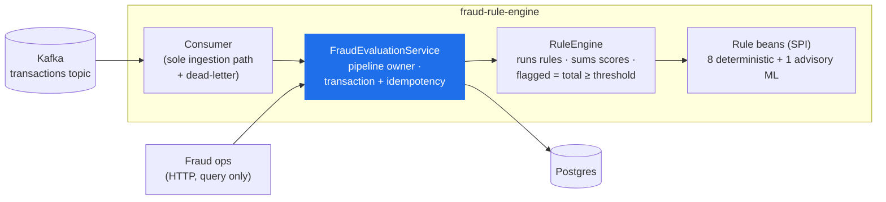

# Fraud Rule Engine — Internal Architecture

A high-level look inside the service. The *why* behind each decision lives in the ADRs
(`docs/adr/`) and the rule catalogue in [rules.md](rules.md) — this page is the map, not the
manual. For how the service fits into a bank, see
[architecture-system-context.md](architecture-system-context.md).

## Shape

## The pipeline, one event at a time

1. An event arrives on the `transactions` topic. A record that won't deserialize or fails
   validation is routed to `transactions-dlt` instead of blocking the partition.
2. `FraudEvaluationService` handles it in **one transaction**: idempotency check on `eventId`
   (a replay returns the stored result), persist the event, then load the customer's recent
   history in a **single query**.
3. `RuleEngine` runs every enabled rule, recording one result per rule — fired or not — and
   sums their scores. `flagged = totalScore ≥ threshold`. **Advisory (shadow) rules are
   recorded but excluded from the total**, so they can be observed in production without ever
   affecting a decision.
4. The evaluation (decision + per-rule audit trail) is stored.
5. Fraud ops retrieve it later via `GET /api/evaluations` — by id, or filtered and paginated.

## Worth knowing

- **The adapter is thin; the service owns the pipeline.** Ingestion logic lives once, behind
  `FraudEvaluationService`. The query API calls the same service for reads.
- **Rules plug in via a code SPI.** Every Spring bean implementing `Rule` is auto-discovered
  and run — adding a rule is adding a bean, nothing else.
- **Rules are pure functions of `(event, history)`.** They do no I/O; the service loads one
  `CustomerHistory` per evaluation and every rule reads from it.
- **Every rule leaves a trace.** A result is recorded whether the rule fired or not, so "why
  *wasn't* this flagged?" is answerable — and shadow rules can be measured.
- **Tuning is config, not code.** Thresholds, windows, scores, and per-rule on/off flags live
  in `fraud.rules.*` and are env-overridable.

The eight deterministic rules (three stateless, five stateful) and the advisory `ANOMALY_SCORE`
scorer are catalogued, with rationale, in [rules.md](rules.md).
</content>
