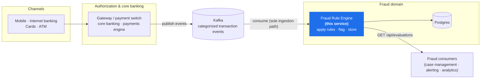

# System Context — Where the Fraud Rule Engine Fits

A short orientation: what this service is, and where it would sit in a bank's transaction
landscape. The internal design is in [architecture-rule-engine.md](architecture-rule-engine.md);
the reasoning behind each decision is in the ADRs (`docs/adr/`).

The fraud rule engine is an **out-of-band detection service**. It consumes categorized
transaction events *after* authorization, scores them against its rule set, stores the result,
and serves it back via an API. It deliberately sits **outside the authorization hot path** — it
flags and records, it does not block.

## How to read it

1. **Channels** (mobile, internet banking, cards, ATM) originate transactions.
2. **Authorization and core banking** post each transaction and publish a **categorized
   transaction event** to Kafka — the input the brief describes.
3. The **fraud rule engine** consumes each event, applies its rules, flags potential fraud,
   and stores the full evaluation.
4. **Fraud consumers** — case management, customer alerting, analytics — read the stored
   evaluations through the engine's retrieval API.

## Scope

- **Detection, not prevention.** This service scores out-of-band; it does not sit in the
  authorization path where a bank would also run inline pre-auth blocking. The brief asks for
  *flagging and retrieval*, so detection is the right scope — the shadow-mode rules are the
  natural bridge toward a blocking role later.
- **Retrieval-only API.** A single Kafka ingress keeps the system to one schema and one set of
  edge validation; everything downstream (alerting, case-management feeds) is illustrative
  context, integrating through the engine's API.
</content>
